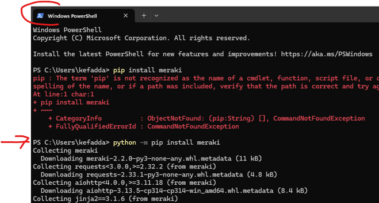
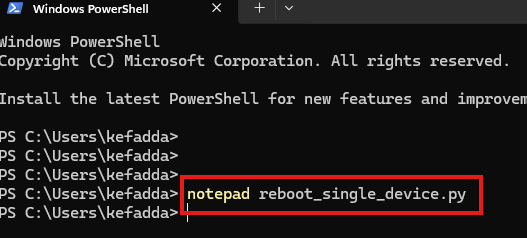
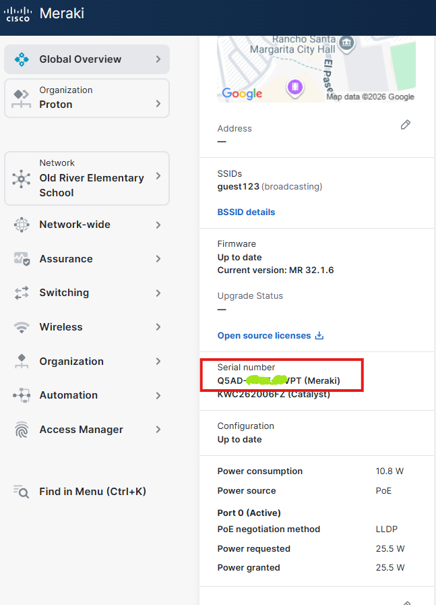
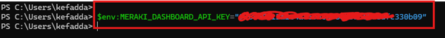
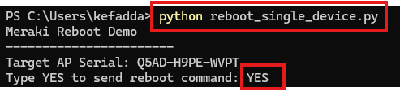
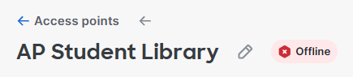
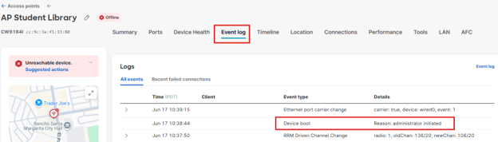

# Lab 01: Reboot a Single Meraki Device

In this lab, you will use the Cisco Meraki Dashboard API and a Python script to reboot one specific Meraki device by serial number.

This exercise will walk you through installing the required Python library, preparing your Meraki Dashboard API key, setting the API key as an environment variable, updating the script with the target device serial number, and running the reboot command.

## Note: This lab is intended for authorized Meraki Dashboard users only. Make sure you have permission to reboot the selected device before running the script.

## 1. Install Python Library
### Step 1.1 Open PowerShell
Use command:
```powershell
 pip install meraki
```

 

 
## 2. Generate or Prepare a Meraki Dashboard API Key

Before running the script, you will need a Meraki Dashboard API key. If you already have an API key, you may use it for this lab. If not, follow the steps below to generate one.

### - Log in to the Meraki Dashboard
### - Click the Organization menu.
### - Under Configuration, select API & Webhooks
### - Select API keys and access.
### - Click Generate API Key.
### - Copy the API key and save it in a secure location.

## Important: The API key will only be shown once. If you lose it, you will need to revoke it and generate a new one.

 


 

**Important:** Copy the API key and save it to a text file in a safe place. You will need this Key.
Check the box stating you've safely stored your API key and click the Done button – If you do not save the key, you will need to revoke the key and generate new one if not saved since it will not be visible again.

 

## 3. Create the Reboot Script

Using Windows PowerShell, Notepad, or Visual Studio Code, create a new Python file named `reboot_single_device.py`.
```powershell
notepad reboot_single_device.py
```



 
Note: For this Lab, you will need to prepare the generated key that was generated as well as the Serial Number – have them ready on a text file.


 

Copy the script below into the file. Then replace `ENTER SERIAL NUMBER HERE` with the serial number of the Meraki device you want to reboot.


```python
import os
import meraki

API_KEY = os.getenv("MERAKI_DASHBOARD_API_KEY")

if not API_KEY:
    raise Exception("Missing MERAKI_DASHBOARD_API_KEY environment variable")

dashboard = meraki.DashboardAPI(API_KEY, suppress_logging=True)

serial = "ENTER SERIAL NUMBER HERE"

print("Meraki Reboot Demo")
print("-----------------------")
print(f"Target AP Serial: {serial}")

confirm = input("Type YES to send reboot command: ")

if confirm == "YES":
    response = dashboard.devices.rebootDevice(serial)
    print("Reboot command sent successfully.")
    print(response)
else:
    print("Cancelled.")
```

If using Power shell, set the environment variable *This command only needs to be run once per PowerShell session.*
```powershell
$env:MERAKI_DASHBOARD_API_KEY="your_api_key_here"
```



 

Run the script using Python:
```powershell
Python reboot_single_device.py
```


 
You can observe the Device before you execute to see if it is online first.
Then, hit enter and monitor the device rebooting by going to the device and Event Log
 




 
 

 

END OF SECTION
