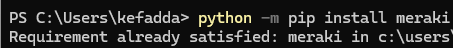

# Lab 02: Reboot All Devices in a Meraki Network

In this lab, you will use the Cisco Meraki Dashboard API and a Python script to reboot all Meraki devices inside one specific Meraki Dashboard network.

This exercise will walk you through confirming your API key, setting the target network name, running the script, reviewing the devices found, confirming the reboot action, and verifying the results in the Meraki Dashboard.

[!WARNING]
"This lab may reboot all Meraki-managed devices inside the selected network, including access points, switches, cameras, security appliances, and other supported devices. Run this only in a demo or approved lab network."

1. Confirm the Meraki Python Library is Installed

Before running the script, confirm that the Meraki Python library is installed on your computer.

Open Windows PowerShell and run the following command:

```python
python -m pip install meraki
```

If the library is already installed, you may see a message similar to:

Requirement already satisfied

This means the Meraki library is already available and you can continue with the lab.

[!NOTE]
*On some Windows computers, the command pip install meraki may not work because pip is not recognized directly. Using python -m pip install meraki is more reliable because it runs pip through your installed Python version.*



delete below this line
 
  
   
    

  


