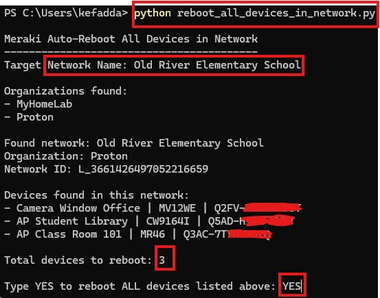
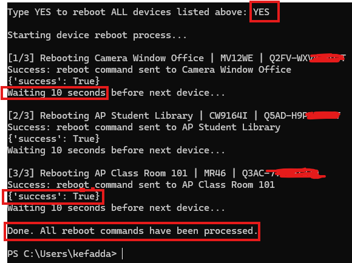
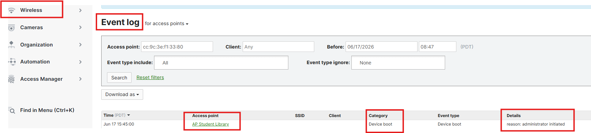

# Lab 02: Reboot All Devices in a Meraki Network

In this lab, you will use the Cisco Meraki Dashboard API and a Python script to reboot all Meraki devices inside one specific Meraki Dashboard network.

This exercise will walk you through confirming your API key, setting the target network name, running the script, reviewing the devices found, confirming the reboot action, and verifying the results in the Meraki Dashboard.

### [!WARNING]
"This lab may reboot all Meraki-managed devices inside the selected network, including access points, switches, cameras, security appliances, and other supported devices. Run this only in a demo or approved lab network."

### 1. Confirm the Meraki Python Library is Installed

Before running the script, confirm that the Meraki Python library is installed on your computer.

Open Windows PowerShell and run the following command:

```powershell
python -m pip install meraki
```

If the library is already installed, you may see a message similar to:

Requirement already satisfied

This means the Meraki library is already available and you can continue with the lab.

### [!NOTE]
*On some Windows computers, the command pip install meraki may not work because pip is not recognized directly. Using python -m pip install meraki is more reliable because it runs pip through your installed Python version.*


### 2. Confirm Your API Key is Active in PowerShell

Before running the script, confirm that your Meraki Dashboard API key is available as an environment variable.

Run the following command:

```powershell
echo $env:MERAKI_DASHBOARD_API_KEY
```


If the API key appears, you can continue to the next step.

If it is blank, set the environment variable again:

```python
$env:MERAKI_DASHBOARD_API_KEY="PASTE_YOUR_API_KEY_HERE"
```

### [!IMPORTANT]
*Do not upload API keys to GitHub. API keys should be stored securely and used only as environment variables during the lab.*

### 3. Create the Reboot Script

Using Windows PowerShell, Notepad, or Visual Studio Code, create a new Python file named:

```python
notepad reboot_all_devices_in_network.py
```

Copy the script below into the file.

Update this line with the name of your demo network:

```script
NETWORK_NAME = "ENTER NETWORK NAME HERE"
```

### 4. Python Script

```script
import os
import time
import meraki

# -----------------------------
# Demo Settings
# -----------------------------
NETWORK_NAME = "ENTER NETWORK NAME HERE"
DELAY_SECONDS = 10

# -----------------------------
# API Key
# -----------------------------
API_KEY = os.getenv("MERAKI_DASHBOARD_API_KEY")

if not API_KEY:
    raise Exception("Missing MERAKI_DASHBOARD_API_KEY environment variable")

# -----------------------------
# Connect to Meraki Dashboard API
# -----------------------------
dashboard = meraki.DashboardAPI(API_KEY, suppress_logging=True)

print("\nMeraki Auto-Reboot All Devices in Network")
print("-----------------------------------------")
print(f"Target Network Name: {NETWORK_NAME}")

# -----------------------------
# Get organizations
# -----------------------------
organizations = dashboard.organizations.getOrganizations()

if not organizations:
    raise Exception("No organizations found for this API key")

print("\nOrganizations found:")
for org in organizations:
    print(f"- {org['name']}")

# -----------------------------
# Find the network by name
# -----------------------------
target_network = None
target_org = None

for org in organizations:
    org_id = org["id"]
    networks = dashboard.organizations.getOrganizationNetworks(org_id)

    for network in networks:
        if network["name"].lower() == NETWORK_NAME.lower():
            target_network = network
            target_org = org
            break

    if target_network:
        break

if not target_network:
    raise Exception(f"Network named '{NETWORK_NAME}' was not found")

network_id = target_network["id"]

print(f"\nFound network: {target_network['name']}")
print(f"Organization: {target_org['name']}")
print(f"Network ID: {network_id}")

# -----------------------------
# Get all devices in the network
# -----------------------------
devices = dashboard.networks.getNetworkDevices(network_id)

if not devices:
    raise Exception("No devices found in this network")

print("\nDevices found in this network:")
for device in devices:
    name = device.get("name") or "No name"
    model = device.get("model") or "No model"
    serial = device.get("serial") or "No serial"
    print(f"- {name} | {model} | {serial}")

# -----------------------------
# Keep only devices that have serial numbers
# -----------------------------
devices_to_reboot = [
    device for device in devices
    if device.get("serial")
]

if not devices_to_reboot:
    raise Exception("No devices with serial numbers were found in this network")

print(f"\nTotal devices to reboot: {len(devices_to_reboot)}")

# -----------------------------
# Safety confirmation
# -----------------------------
confirm = input("\nType YES to reboot ALL devices listed above: ")

if confirm != "YES":
    print("Operation cancelled.\n")
    exit()

# -----------------------------
# Reboot devices one by one
# -----------------------------
print("\nStarting device reboot process...\n")

for index, device in enumerate(devices_to_reboot, start=1):
    name = device.get("name") or "No name"
    model = device.get("model") or "No model"
    serial = device.get("serial")

    try:
        print(f"[{index}/{len(devices_to_reboot)}] Rebooting {name} | {model} | {serial}")

        response = dashboard.devices.rebootDevice(serial)

        print(f"Success: reboot command sent to {name}")
        print(response)
        print(f"Waiting {DELAY_SECONDS} seconds before next device...\n")

        time.sleep(DELAY_SECONDS)

    except Exception as e:
        print(f"Error rebooting {name} | {serial}")
        print(e)
        print("Continuing to next device...\n")

print("Done. All reboot commands have been processed.\n")
```
### 5. Run the Script

After saving the file, run the script from PowerShell:

```powershell
python reboot_all_devices_in_network.py
```

The script will:

#### - Connect to the Meraki Dashboard API.
#### - Search for the target network by name.
#### - Pull all devices from that network.
#### - Display the device name, model, and serial number.
#### - Ask for confirmation before taking action.
#### - Reboot each device one by one. For real world scenario, you may need to increase the delay time to more than 10 seconds.
#### - Wait between each reboot command before moving to the next device.

### Confirm the Reboot
When prompted, the script will ask:
Type YES to reboot ALL devices listed above:
Type:
# YES
*The script will then begin sending reboot commands to each device in the selected network.*







### 6. Verify in the Meraki Dashboard

After the script runs, go back to the Meraki Dashboard and open the target network.

You can verify the reboot activity by checking:

The device status

The device event log 
The network event log
Device connectivity after reboot




### End of Lab 02


  


