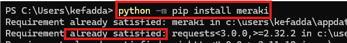

# *UNDER CONSTRUCTION - WORKING ON IT NOW*
# Lab 03: Meraki Workflow Automation

In this lab, you will explore Cisco Workflows inside the Meraki Dashboard and use a pre-built workflow from the Cisco Workflow Exchange.

For this exercise, we will use the Create Wireless SSID with PSK Authentication workflow. This workflow demonstrates how automation can simplify common Meraki Dashboard tasks, such as creating a wireless SSID with WPA2-PSK authentication.


> [!NOTE]
> *This lab is designed to demonstrate workflow automation using the Meraki Dashboard and Cisco Workflows. No Python scripting is required for this lab.*


## Learning Objectives


By the end of this lab, you will be able to:

- [Generate or prepare a Meraki Dashboard API key](#1-generate-or-prepare-a-meraki-dashboard-api-key)
- [Access Cisco Workflows from the Meraki Dashboard](#2-access-cisco-workflows-from-the-meraki-dashboard)
- [Connect Cisco Workflows to Meraki using Targets](#3-connect-cisco-workflows-to-meraki-using-targets)
- [Explore the Cisco Workflow Exchange](#4-explore-the-cisco-workflow-exchange)
- [Install a pre-built Meraki workflow](#5-install-a-pre-built-meraki-workflow)
- [Run the workflow to create a wireless SSID](#6-run-the-workflow-to-create-a-wireless-ssid)
- [Verify the SSID in the Meraki Dashboard](#7-verify-the-ssid-in-the-meraki-dashboard)

 ## 1. Generate or Prepare a Meraki Dashboard API Key
 Before connecting Cisco Workflows to Meraki, you will need a Meraki Dashboard API key.

If you already generated an API key prevoiusly, you may use the same API key for this lab.

If you do not have an API key, generate one from the Meraki Dashboard.

#### Steps to Generate an API Key
- Log in to the Meraki Dashboard.
- Click the Organization menu.
- Under Configuration, select API & Webhooks.
- Select API keys and access.
- Click Generate API Key.
- Copy the API key and save it in a secure location.

  
  
  

  
  
  

[!IMPORTANT]
*The API key is shown only once. If you lose it, you will need to revoke it and generate a new one.*

*Do not upload API keys to GitHub or share them in screenshots.*

## 2. Access Cisco Workflows from the Meraki Dashboard
Open a browser and log in to the [Meraki Dashboard](https://dashboard.meraki.com).
> [!TIP]
> *To keep this lab guide open, right-click the link and select **Open link in new tab**, or hold **Ctrl** while clicking the link.*


After logging in, select the correct organization and network for your lab environment.

From the left navigation menu, go to:

#### Automation

Cisco Workflows is available from the Automation section of the Meraki Dashboard.


## 3. Connect Cisco Workflows to Meraki Using Targets


## delete all below - this is only template to use for lab 03

```powershell
python -m pip install meraki
```




