# *UNDER CONSTRUCTION - WORKING ON IT NOW*
# Lab 03: Meraki Workflow Automation

In this lab, you will explore **Cisco Workflows** inside the Meraki Dashboard and use a pre-built workflow from the **Cisco Workflow Exchange**.

For this exercise, we will use the **Create Wireless SSID with PSK Authentication workflow**. This workflow demonstrates how automation can simplify common Meraki Dashboard tasks, such as creating a wireless SSID with WPA2-PSK authentication.


> [!NOTE]
> *This lab is designed to demonstrate workflow automation using the Meraki Dashboard and Cisco Workflows. No Python scripting is required for this lab.*


## Learning Objectives


By the end of this lab, you will be able to:

- [1. Generate or prepare a Meraki Dashboard API key](#1-generate-or-prepare-a-meraki-dashboard-api-key)
- [2. Access Cisco Workflows from the Meraki Dashboard](#2-access-cisco-workflows-from-the-meraki-dashboard)
- [3. Connect Cisco Workflows to Meraki using Targets](#3-connect-cisco-workflows-to-meraki-using-targets)
- [4. Explore the Cisco Workflow Exchange](#4-explore-the-cisco-workflow-exchange)
- [5. Install a pre-built Meraki workflow](#5-install-a-pre-built-meraki-workflow)
- [6. Run the workflow to create a wireless SSID](#6-run-the-workflow-to-create-a-wireless-ssid)
- [7. Verify the SSID in the Meraki Dashboard](#7-verify-the-ssid-in-the-meraki-dashboard)

 ## 1. Generate or Prepare a Meraki Dashboard API Key
 Before connecting Cisco Workflows to Meraki, you will need a Meraki Dashboard API key.

If you already generated an API key prevoiusly, you may use the same API key for this lab.

If you do not have an API key, generate one from the Meraki Dashboard.

#### Steps to Generate an API Key
- Log in to the Meraki Dashboard.
- Click the **Organization** menu.
- Under **Configuration**, select **API & Webhooks**.
- Select **API keys and access**.
- Click **Generate API Key**.
- Copy the API key and save it in a secure location.

  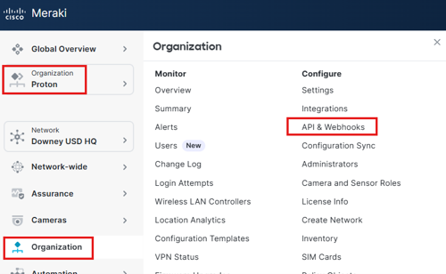
  
  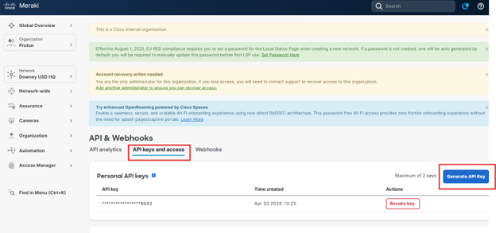

  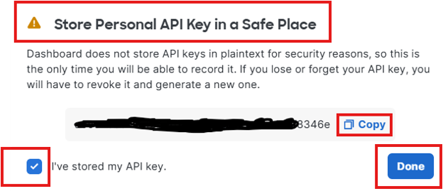
  
  

> [!IMPORTANT]
> *The API key is shown only once. If you lose it, you will need to revoke it and generate a new one.*

*Do not upload API keys to GitHub or share them in screenshots.*

## 2. Access Cisco Workflows from the Meraki Dashboard
Open a browser and log in to the [Meraki Dashboard](https://dashboard.meraki.com).
> [!TIP]
> *To keep this lab guide open, right-click the link and select **Open link in new tab**, or hold **Ctrl** while clicking the link.*


After logging in, select the correct organization and network for your lab environment.

From the left navigation menu, go to **Automation**


Cisco Workflows is available from the Automation section of the Meraki Dashboard.
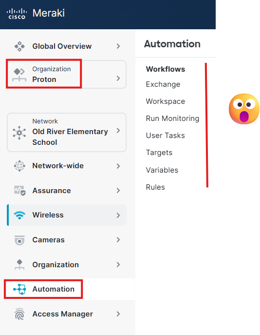


## 3. Connect Cisco Workflows to Meraki Using Targets
Before running a Meraki workflow, Cisco Workflows needs a connection to the Meraki Dashboard API. This connection is configured using **Targets**.

A **Target** is the system or resource that Cisco Workflows will communicate with when the workflow runs. Targets can be different types depending on what the workflow needs to connect to.

For this lab, the workflow will connect to Meraki, so the Target Type must be:

Meraki Endpoint

> [!NOTE]
> Cisco Workflows can use different Target Types depending on the automation use case. For this lab, we are using a **Meraki Endpoint** because the workflow needs to communicate with the Meraki Dashboard API.

### Create a New Meraki Target

In the Meraki Dashboard, navigate to: **Automation > Targets**

Follow these steps:

Click **Automation** from the left menu.
Under **Workflows**, select **Targets**.
Click + **New target**.
Select the Target Type:
**Meraki Endpoint**
Enter a name for the Target.

Example:
```
DEMO- Meraki Dashboard Target
```
> [!NOTE]
> *If a **Meraki Endpoinbt** Target already exists in your lab environment, you may be able to use the existing Target instead of creating a new one.*

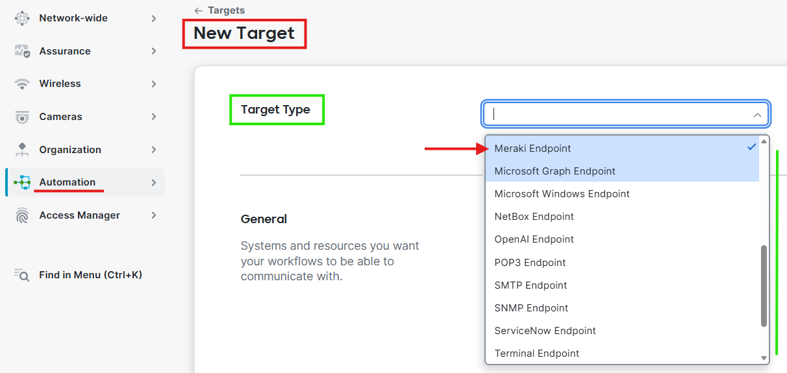


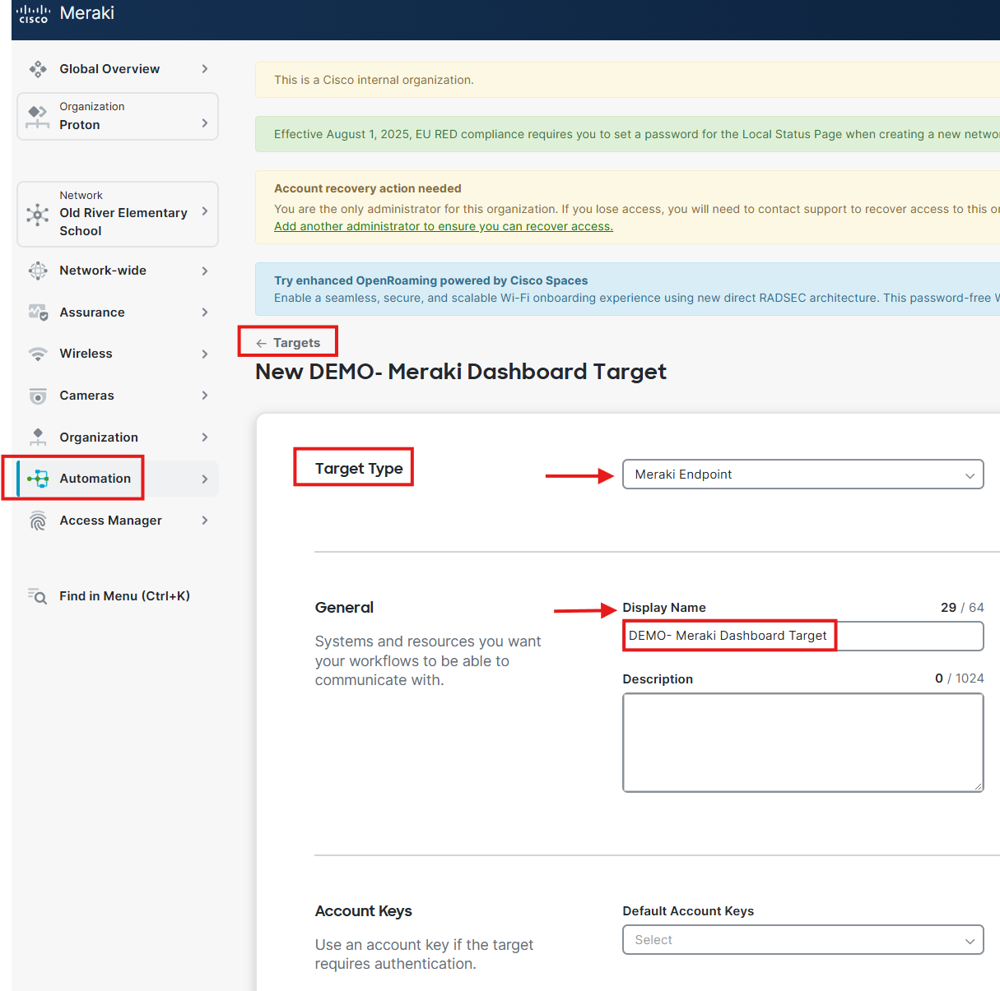


### Create a new account key using the following information:

Display Name:
```
DEMO-Meraki API
```

Account Key Type:
```
Meraki Credentials
```

Meraki API Key: ```Paste your Meraki Dashboard API key```

Click **Save**


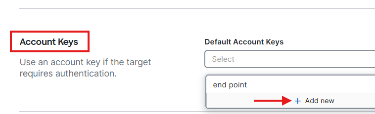

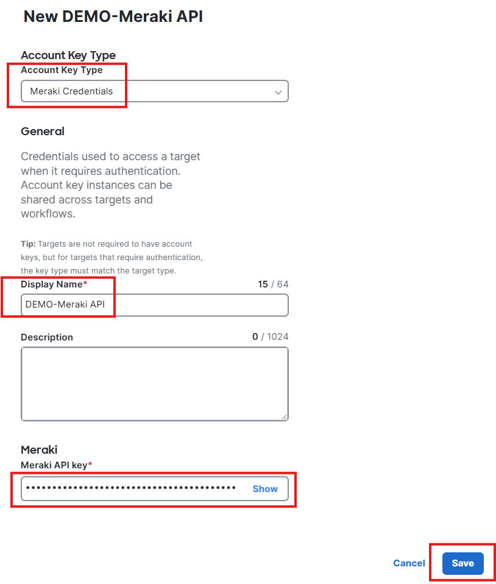


### Validate the Target

After saving, confirm that the Target status is **blue** and shows as **valid**.

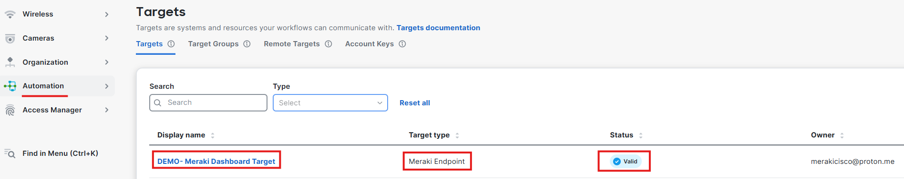

A valid Target confirms that Cisco Workflows can successfully authenticate and communicate with the Meraki Dashboard API.

> [!IMPORTANT]
> *The Target must show as valid before running the workflow. If the Target is not valid, the workflow will not be able to make changes in the Meraki Dashboard.*

> [!TIP]
> Congratulations! You have successfully connected your first Meraki Target to Cisco Workflows. You are now ready to begin automating Meraki solutions. 


## 4. Explore the Cisco Workflow Exchange

After the Meraki Target is configured, open the Cisco Workflow Exchange.

The Workflow Exchange provides pre-built automation workflows that can be installed and used to automate common tasks across Cisco platforms, including Meraki.

For this lab, locate the workflow named:

**Create Wireless SSID with PSK Authentication**

This is a Cisco-managed workflow designed to automate the creation of a secure wireless SSID using **WPA2-PSK authentication**.

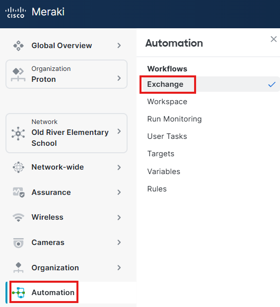

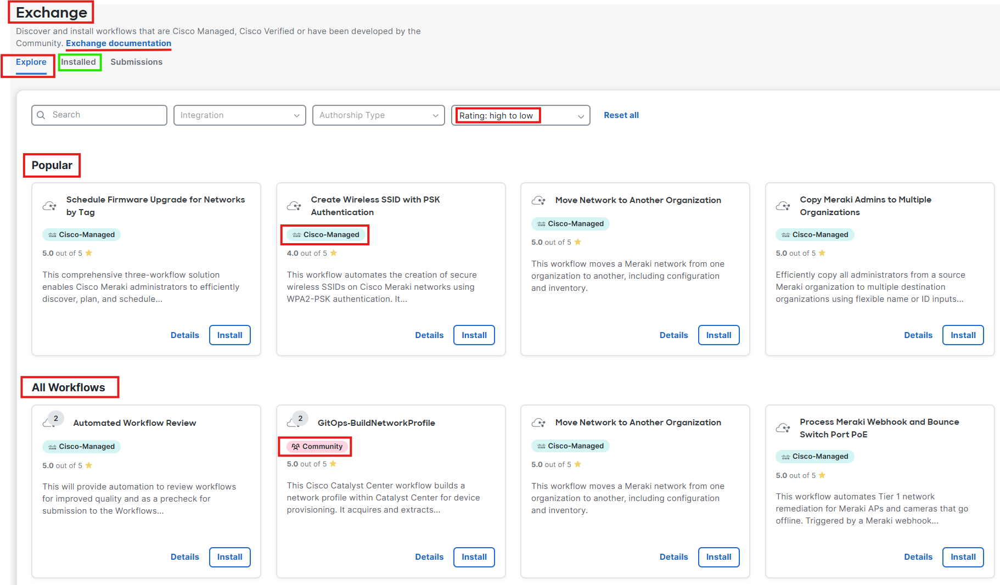


## 5. Install a Pre-Built Meraki Workflow

After locating the Create Wireless SSID with PSK Authentication workflow, click: **Install**

This will add the workflow to your Cisco Workflows environment so it can be reviewed, configured, and executed.

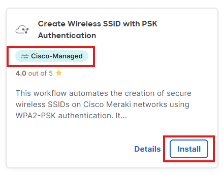

> [!NOTE]
> *Installing the workflow does not immediately make changes to your Meraki network. The workflow must be run before it performs any action.*

## 6. Review the Create Wireless SSID with PSK Authentication Workflow

Before running the workflow, review the workflow details and understand what it is designed to do.

This workflow helps automate the creation of a wireless SSID in a Meraki network using pre-shared key authentication.

During the workflow review, pay attention to:

- The required input fields
- The Meraki organization or network selection
- The SSID name
- The pre-shared key configuration
- Any additional wireless settings included in the workflow

> [!WARNING]
> Make sure you are working in the correct demo network before running the workflow.


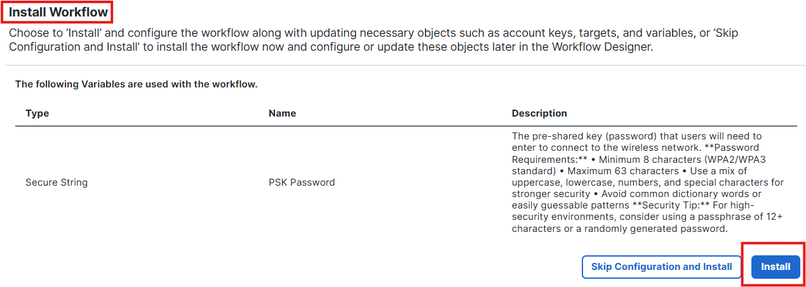


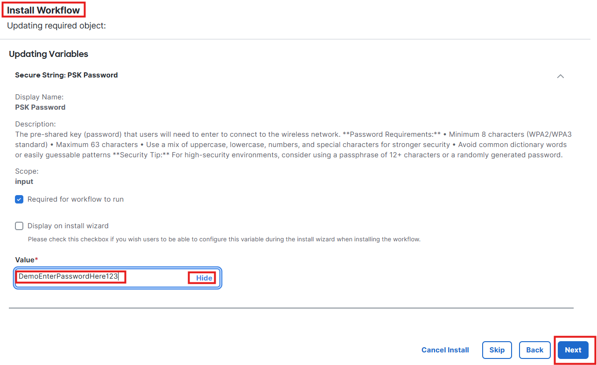

Once clicked Next, the workflow will be installed. Choose **Maybe later** since you will run it from a different location.

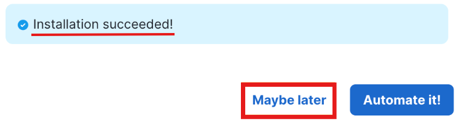


## 7. Run the Workflow to Create a Wireless SSID

Run the installed workflow from **Automation** > **Workspace** 

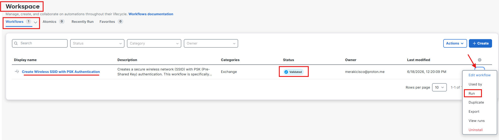

Choose Target **DEMO-Meraki Dashboard Target**
Enter Input variables:
Organization Name: **YOUR ORGANIZATION NAME HERE**
SSID Name: **DEMO-GUEST-01**
Network Name: **ENTER NETWORK NAME HERE**


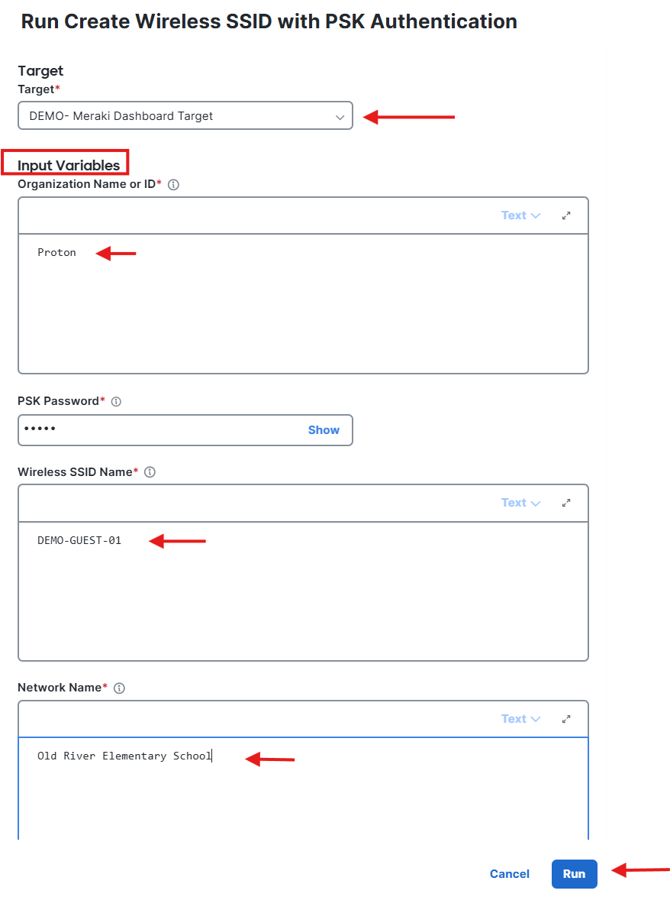

After entering the required values, start the workflow.

The workflow will use Meraki Dashboard automation to create the wireless SSID based on the inputs provided.

> [!IMPORTANT]
> *Use a demo SSID name and test pre-shared key for this lab. Do not use production wireless credentials.*


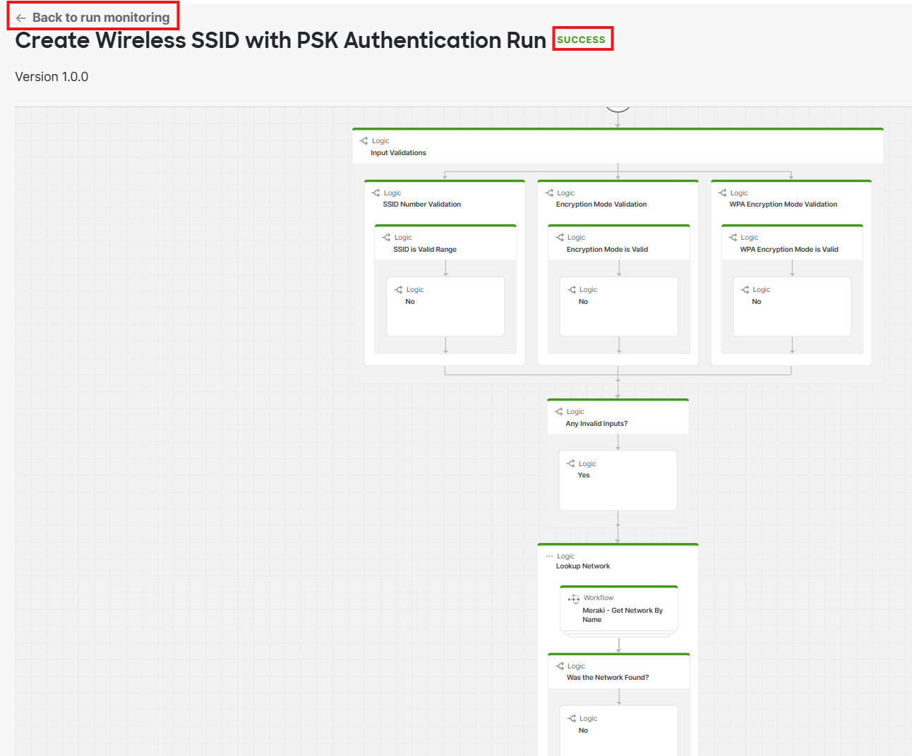


## 8. Verify the SSID in the Meraki Dashboard

After the workflow completes, return to the Meraki Dashboard and verify that the SSID was created.

Navigate to: **Wireless > Configure > SSIDs**


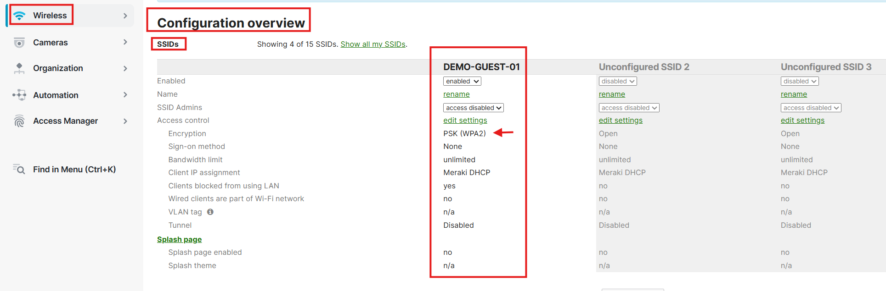

Confirm that the new SSID appears in the list and review the configured settings.

You may also validate:

SSID name
Authentication method
PSK configuration
SSID enabled or disabled status


## Lab Summary

In this lab, you used Cisco Workflows inside the Meraki Dashboard to automate the creation of a wireless SSID.

You completed the following tasks:

Prepared a Meraki Dashboard API key.
Accessed Cisco Workflows from the Meraki Dashboard.
Connected Cisco Workflows to Meraki using Targets.
Explored the Cisco Workflow Exchange.
Installed a Cisco-managed workflow.
Ran the workflow to create a wireless SSID.
Verified the SSID in the Meraki Dashboard.

This lab demonstrates how Cisco Workflows can help automate common network operations without requiring custom Python scripts.

## End of Lab 03


